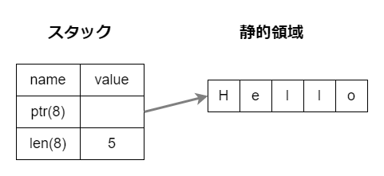

# 文字に関するデータ型

`char`と`&str`（文字列スライス）と`String`が存在します。

`char`はユニコードの1文字を表現します。

`&str`は文字列スライスと呼ばれるもので、UTF-8の配列で、いわゆる文字列リテラルを表現します。

`String`は文字列を表すUTF-8のベクター型（変更可能な配列）です。

`&str`と`String`はどちらも文字列を表現する配列ですが、以下のような特徴があります。

|特徴|`&str`|`String`|
|---|---|---|
|型|スライス型(`&[u8]`)|ベクター型(Vec\<u8>)|
|mut?|immutable|mutable|

https://qiita.com/kujirahand/items/fcb4f75dbdbfaf36aa75

# `&str`と`String`

いわゆる文字列を表すデータ型として、`&str`と`String`が存在します。

`&str`は**プリミティブ型**の一種であり、固定長のプリミティブ型のスライスです。

https://qiita.com/yagince/items/e7474839246ced595f7a

文字列スライスは、値が**コンパイル時に確定している**ので、値は**バイナリーファイルに直接記述されます**。

対して`String`型は、コンパイル時に不明な量のメモリーを**ヒープに確保**します。

`String`はVec\<u8\>として保持するベクター型です。（ベクターはサイズの変更可能な配列）。

https://qiita.com/Kogia_sima/items/88920a2a14448ef4dbe3

## `&str`型

`&str`は特に**文字列スライス**とも呼ばれ、UTF-8のバイト列への参照です。プリミティブ型です。

```rust
fn main() {
    let s1 = "HelloHelloHello";
    let s2 = "Hello";
}
```

この時、`s1`用に15バイト、`s2`用に5バイトのメモリーが確保される。`{:p}`でメモリーのアドレスを取り出すことができる。

```rust
fn main() {
    let s1 = "Hello"; // 15bytes
    let s2 = "Hello"; // 6bytes

    println!("{:p}", s1);
    //=> 0x342098f778

    println!("{:p}", s2);
    //=> 0x342098f788
}
```

`0x88 - 0x78`は10進数で16なので、16バイト分のずれがある。

## `&str`のデータ取扱い

`&str`は以下のようにメモリー上に存在している。



スタックアドレスは`{:p}`で取得できるが、`ptr`や`len`に格納されている実データは`as_ptr()`や`as_len()`メソッドで取得できる。

```rust
fn main() {
    let s1 = "HelloHelloHelloHelloHello"; // 25bytes
    let s2 = "Hello"; // 5bytes

    println!("{:p}", &s1);
    //=> 0xa9042ff898
    println!("{:p}", &s2);
    //=> 0xa9042ff8a8

    println!("{:p}", s1.as_ptr());
    //=> 0x7ff73e30d440
    println!("{:p}", s2.as_ptr());
    //=> 0x7ff73e30d459

    println!("{}", s1.len());
    //=> 25

    println!("{}", s2.len());
    //=> 5
}
```

整理します。

`&str`のスタックアドレスは`{:p} &var`で取得できます。`&str`はどんな長さの文字列であろうと`ptr`8バイト、`len`8バイトの16バイトです。`0xa8 - 0x98`が10進数16なので`s1`と`s2`のスタックアドレスは16バイトずれていることになり、スタック上に連続して配置されていることがわかります。

`&str`の`ptr`に格納されている**静的領域のアドレス**は`as_ptr()`で取得することができます。`0x59 - 0x40`は10進数25なので、静的領域に`s1`のデータが25バイト格納され、連続して`s2`のデータが格納されていることがわかります。

## 文字列

文字列スライス（`&str`）と文字列（`String`）。

> &str を、**変更できない文字列データ**へのポインターと考えることができます。

`&str` -> スライス、`String` -> ベクター。スライスは配列やベクターへの参照。

|&str|String|
|---|---|
|スライス|ベクター|
|ヒープ||


## スライスって？

スライスは配列やVectorへの**参照**のこと。

>スライスというのは固定配列の一部分で自分を表現する型の事で、元となる配列（サイズ変更が出来ないコンパイル時にサイズが確定する文字配列）が必要になります。つまり&str型は「元となる固定配列を参照する事で存在出来る型」という事です。そのため&（参照）が付いているんですね。

## `String`型

Stringは以下の要素で構成されます。

- **ヒープ**に格納された UTF-8 バイト列
- String 構造体。以下のフィールドを持つ
    - UTF-8 バイト列へのポインタ
    - 文字列の長さ
    - 文字列のキャパシティ（ヒープの再割り当てなしで格納できる UTF-8 バイト長）

String型のスタックに積まれます。ポインターがヒープメモリーにあるデータの先頭アドレスを示しています。

https://qiita.com/yagince/items/e7474839246ced595f7a

https://note.com/marupeke296/n/n9b69cc5b45d4

## `String`と`&str`の変換

`&str`から`String`に変換するには`to_string()`を使用します。

```rust
fn main() {
    let s = "Hello";
    let t = s.to_string();

    println!("{}, {}", s, t);
    //=> Hello, Hello
}
```

```rust
fn main() {
    let s = String::from("Hello");
    let t = s.as_str();

    println!("{}, {}", s, t);
    //=> Hello, Hello
}
```

## 所有権があるか

`String`は所有権があるためmoveが起こるが、`&str`は借用。

```rust
// &str
fn main() {
    let s = "Hello";
    let t = s;

    println!("{}, {}", s, t);
    //=> Hello, Hello
}
```

```rust
// String
fn main() {
    let s = String::from("Hello");
    let t = s;

    println!("{}, {}", s, t);
}
/*
Compiling playground v0.0.1 (/playground)
error[E0382]: borrow of moved value: `s`
 --> src/main.rs:5:24
  |
2 |     let s = String::from("Hello");
  |         - move occurs because `s` has type `String`, which does not implement the `Copy` trait
3 |     let t = s;
  |             - value moved here
4 |
5 |     println!("{}, {}", s, t);
  |                        ^ value borrowed here after move
  |
  = note: this error originates in the macro `$crate::format_args_nl` which comes from the expansion of the macro `println` (in Nightly builds, run with -Z macro-backtrace for more info)

For more information about this error, try `rustc --explain E0382`.
error: could not compile `playground` due to previous error
*/
```

