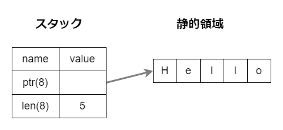
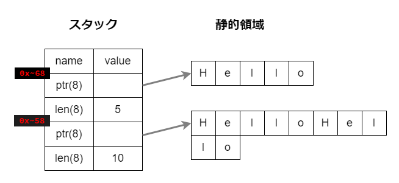

# 文字に関するデータ型

`char`と`&str`（文字列スライス）と`String`が存在します。

`char`はユニコードの1文字を表現します。

`&str`は文字列スライスと呼ばれるもので、UTF-8の配列で、いわゆる文字列リテラルを表現します。

`String`は文字列を表すUTF-8のベクター型（変更可能な配列）です。

# `&str`と`String`

いわゆる文字列を表すデータ型として、`&str`と`String`が存在します。どちらも文字列を表現する配列ですが、以下のような特徴があります。

|特徴|`&str`|`String`|
|---|---|---|
|型|スライス型(`&[u8]`)|ベクター型(`Vec<u8>`)|
|データ|プリミティブ|変更可能な配列|
|変更可能か|immutable|mutable|
|実データの保存場所|静的領域|ヒープ領域|
|所有権|持たない|持つ|

# `&str`型

`&str`は特に**文字列スライス**とも呼ばれ、プリミティブ型です。いわゆる文字列リテラルというやつは`&str`Rustでは`&str`にあたります。以下の場合は推論が働き、`s1`や`s2`は`&str`型とみなされます。

```rust
fn main() {
    let s1 = "HelloHello";
    let s2 = "Hello";
}
```

## `&str`の仕組み

`&str`はUTF-8のバイト列への**参照**です。以下のように2つの変数を宣言した時、`s1`用に10バイト、`s2`用に5バイトの保存領域が**静的領域上**に確保されます。

`&str`自体は参照であるため、`{:p}`でスタックメモリーの先頭アドレスを取り出すことができます。

```rust
fn main() {
    let s1 = "HelloHello"; // 10bytes
    let s2 = "Hello"; // 5bytes

    println!("{:p}", &s1);
    //=> 0x7fff00832958

    println!("{:p}", &s2);
    //=> 0x7fff00832968
}
```

アドレスの末尾2桁を引き算してみます。`0x68 - 0x58`は10進数で16なので、16バイト分のずれがありますね。もっとバイト数を増やしてみるとどうでしょうか。

```rust
fn main() {
    let s1 = "吾輩は猫である。名前はまだ無い。"; // 48bytes
    let s2 = "Hello"; // 5bytes

    println!("{:p}", &s1);
    //=> 0x7fff54bd6548

    println!("{:p}", &s2);
    //=> 0x7fff54bd6558
}
```

`s1`は48バイトですが、`0x58 - 0x48`は10進数で16です。先ほどと変わりませんね。よって、`s1`のバイト数によってスタック上に占める領域は変わらないと言えます（文字列がスタック上に積まれているわけではなさそう）。この16バイトは一体なんなのでしょうか？

## `&str`のデータ取扱い

`&str`は実データへの**参照**でありスタックに積まれます。そして、それが指し示す実データは静的領域上に存在しています。



`&str`は静的領域上の実データの先頭アドレスへの参照である`ptr`、そして実データのバイト数を表す`len`です。どちらもスタック上のサイズは8バイトであり、併せて16バイトです。このことから、先ほどまで検証していた時の16バイトのずれの説明がつきます。

さて、これまでに`{:p}`で取得してきたアドレスはスタック上のデータの先頭アドレスです。改めて図解するとおおよそ以下の状態になっていると考えられます。



`ptr`や`len`に格納されているデータは`as_ptr()`や`as_len()`メソッドで取得できます。

```rust
fn main() {
    let s1 = "HelloHello"; // 10bytes
    let s2 = "Hello"; // 5bytes

    println!("{:p}", &s1);
    //=> 0x7fff00832958
    println!("{:p}", &s2);
    //=> 0x7fff00832968

    println!("{:p}", s1.as_ptr());
    //=> 0x5596fff0705b
    println!("{:p}", s2.as_ptr());
    //=> 0x5596fff07065

    println!("{}", s1.len());
    //=> 10

    println!("{}", s2.len());
    //=> 5
}
```

先述した通り、`ptr`には静的領域に保存されている実データの先頭アドレスが格納されています。これらのアドレスの下2桁を引き算してみましょう。`0x65 - 0x5b`は10進数で10です。s1の実データのバイト数は10ですから、静的領域上に`s1`のデータが10バイト保存されていて、続けて`s2`のデータが5バイト格納されていると考えられます。

まとめます。

- `&str`は静的領域に保存されている実データへの参照であり、スタックに積まれます。

- `&str`は`ptr`8バイトと`len`8バイトからなります。これは`&str`のデータがどのような大きさでも変わりません。

- `ptr`は実データの先頭アドレス、`len`は実データのバイト数を保存しています。

- `&str`の先頭アドレスは`{:p} &var`で取得できます。

- `ptr`は`as_ptr()`、`len`は`len()`で取得できます。

https://qiita.com/yagince/items/e7474839246ced595f7a

https://qiita.com/kujirahand/items/fcb4f75dbdbfaf36aa75

https://qiita.com/Kogia_sima/items/88920a2a14448ef4dbe3

https://zenn.dev/philomagi/articles/rust_why_cant_use_str_as_both_argument_and_return

https://www.zakioka.net/blog/memory-management-for-rust/

https://www.zakioka.net/blog/memory-management-for-rust/

https://techracho.bpsinc.jp/yoshi/2021_12_24/114720

https://qiita.com/Kogia_sima/items/88920a2a14448ef4dbe3

https://qiita.com/k-yanai60/items/4c8e3562fe6d22f845a9

## スライスって？

文字列スライスは、値が**コンパイル時に確定している**ので、値は**バイナリーファイルに直接記述されます**。

スライスは配列やVectorへの**参照**のこと。

>スライスというのは固定配列の一部分で自分を表現する型の事で、元となる配列（サイズ変更が出来ないコンパイル時にサイズが確定する文字配列）が必要になります。つまり&str型は「元となる固定配列を参照する事で存在出来る型」という事です。そのため&（参照）が付いているんですね。

> スライスはC言語でいうところのポインタに加えて長さを保持しているもので（ファットポインタ）、それによって範囲外アクセスが起きないようチェックできる。

https://tyfkda.github.io/blog/2020/04/02/rewindable-slice.html


<!-- ----------------------------------------------------------------------------------------------------------------------------->

## String

対して`String`型は、コンパイル時に不明な量のメモリーを**ヒープに確保**します。

`String`はVec\<u8\>として保持するベクター型です。（ベクターはサイズの変更可能な配列）。
文字列スライス（`&str`）と文字列（`String`）。

Stringは以下の要素で構成されます。

- **ヒープ**に格納された UTF-8 バイト列
- String 構造体。以下のフィールドを持つ
    - UTF-8 バイト列へのポインタ
    - 文字列の長さ
    - 文字列のキャパシティ（ヒープの再割り当てなしで格納できる UTF-8 バイト長）

String型のスタックに積まれます。ポインターがヒープメモリーにあるデータの先頭アドレスを示しています。

https://qiita.com/yagince/items/e7474839246ced595f7a

https://note.com/marupeke296/n/n9b69cc5b45d4

https://qiita.com/iwatake2222/items/79fe0f33fa33d7e2f5c5#string

https://zenn.dev/masayannuu/articles/beed577d02dec5

https://helabenkhalfallah.medium.com/rust-in-a-nutshell-ownership-a9cd6afeb280

## `String`と`&str`の変換

`&str`から`String`に変換するには`to_string()`を使用します。

```rust
fn main() {
    let s = "Hello";
    let t = s.to_string();

    println!("{}, {}", s, t);
    //=> Hello, Hello
}
```

```rust
fn main() {
    let s = String::from("Hello");
    let t = s.as_str();

    println!("{}, {}", s, t);
    //=> Hello, Hello
}
```

## 所有権があるか

`String`は所有権があるためmoveが起こるが、`&str`は借用。

```rust
// &str
fn main() {
    let s = "Hello";
    let t = s;

    println!("{}, {}", s, t);
    //=> Hello, Hello
}
```

```rust
// String
fn main() {
    let s = String::from("Hello");
    let t = s;

    println!("{}, {}", s, t);
}
/*
Compiling playground v0.0.1 (/playground)
error[E0382]: borrow of moved value: `s`
 --> src/main.rs:5:24
  |
2 |     let s = String::from("Hello");
  |         - move occurs because `s` has type `String`, which does not implement the `Copy` trait
3 |     let t = s;
  |             - value moved here
4 |
5 |     println!("{}, {}", s, t);
  |                        ^ value borrowed here after move
  |
  = note: this error originates in the macro `$crate::format_args_nl` which comes from the expansion of the macro `println` (in Nightly builds, run with -Z macro-backtrace for more info)

For more information about this error, try `rustc --explain E0382`.
error: could not compile `playground` due to previous error
*/
```

